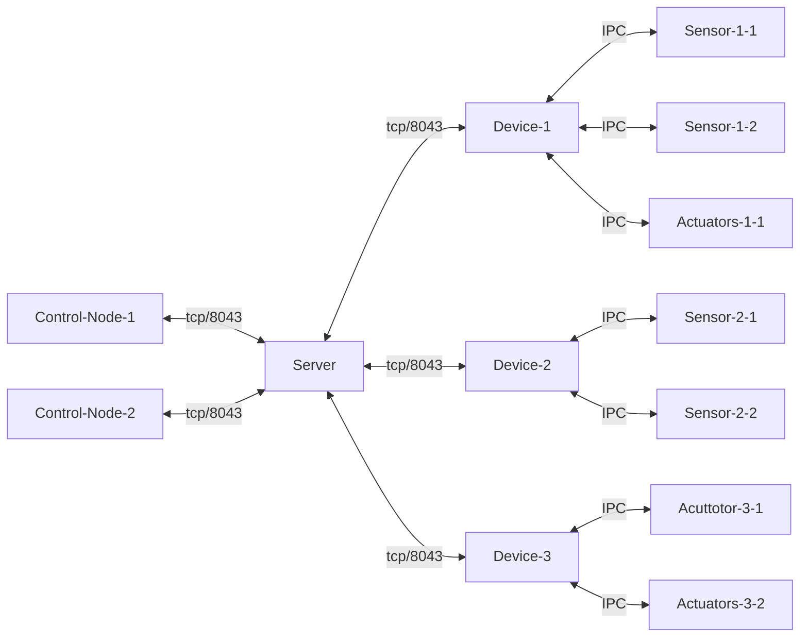
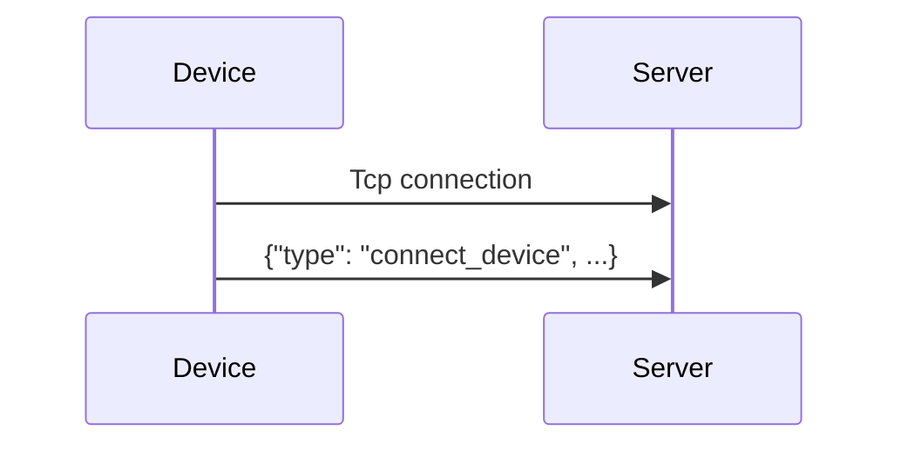

# Protocol

This document describes the binary protocol for the <TODO> smart home system.

## Terminology
| Term | Definition                                                                                                                                   |
| :---: |:---------------------------------------------------------------------------------------------------------------------------------------------|
| length-prefixed | A encoding scheme where the length of a payload is sent before the payload itself, allowing readers to pre-allocate buffers.                 |
| big-endian | A byte encoding where the most significant byte comes first, matches most intuitions, <https://en.wikipedia.org/wiki/Endianness>             |
| json | A common plaintext structured format, thats self describing and supported by a wide range of languages, <https://en.wikipedia.org/wiki/JSON> |
| tcp | A low level transport-layer protocol that provides reliability and ordering, <https://en.wikipedia.org/wiki/TCP>                             | 
| UTF-8 | The most common text encoding that handles all of unicode, and widely supported. <https://en.wikipedia.org/wiki/UTF-8>                       |
| Node | A client in the network, either an iot device or a controller.                                                                               |
| Server | The central server/brooker                                                                                                                   |
| Controller | A controller-node that connects to the central server in order to issue commands and view the status of the network                          |
| Device | A Physical iot device, acts as one network client/node, may contain multiple local sensors/acctutors                                         |


## Payloads and connections

### Connection
We use a persistent TCP connection to a central server on port `8043`.

All clients, control-nodes and sensor-nodes, will connect to the central server which will act as a broker as described later on. Each device will then be responsible for multiple sensors/actuators.


> [!NOTE]
> communication between devices and its onboard sensors/actuators are outside the scope of this specification, as long as the device exposes the required addressing capabilities which will be described later on in this document.

### Packets

The core message format is length-prefixed json.
Specifically each packet start with 8 bytes (64 bits) in big-endian encoding a length `n`, the next `n` bytes are the json payload encoded as utf-8.

For example the payload `{"value": 20}` would be sent as (in hexadecimal) `000000000000000d7b2276616c7565223a2032307d`, where:
```
000000000000000d            - 13
7b2276616c7565223a2032307d  - {"value": 20}
```

## Payload structure

All payloads have a root level `type` key, which indicates the kind of command/message it is. 
In addition each message will contain a `request_id`, if the message is a request this will be a new id minted by the client, any responses to that request will have their `request_id` field set to the same value.

> [!WARNING]
> It is the clients responsibility to ensure request ids are unique for that connection, if requests ids are re-used the server behaviour is undefined. 

### Addressing 
Devices get allocated an id upon connection, and enumerate their internal sensor/actuators addressing. The global sensor/actuators addresses are then `{device_id}.{sensor_id}`. for example a device with id `3`, with a sensor at id `2` would be addressed as `3.2`.

The exact allocation and format of ids is up to the server and individual devices, the only restriction is that the ids must not contain a `.`.

### Device connection flow

On connection the device will send a `connect_device` payload containing user facing metadata such as names, as well as its sensors/actuators.
```json
{
    "type": "connect_device",
    "request_id": "...",
    "name": "IKEA ...",
    "capabilities": {
        "temperature": {
            "type": "sensor"
            "name": "Temperature",
            // TODO: sensor configuration
        },
        // ...
    } 
}
```



### Error handling

In the event of a processing error the server will respond with a `error` payload, containing a `msg` field, and a *optional* `request_id` field (if the server fails to read the json completely it will not include the request id).

```json
{
    "type": "error",
    "request_id": "...",
    "msg": "Expected field ...."
}
```

